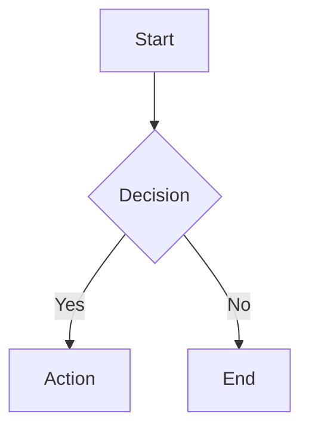

# Markdown Extensions

> **Status:** Draft  
> **Version:** 0.1.0  
> **Created:** 2026-01-25  
> **Last Modified:** 2026-01-25  
> **Author:** [Martin Stühmer](https://github.com/samtrion)  
> **Parent:** [Routing Specification](./routing.md)

---

## 1. Overview

This specification defines Markdown extensions for ForgingBlazor.

Markdown extensions enhance content authoring with features like syntax highlighting, diagrams, mathematical expressions, and custom components.

---

## 2. Problem Statement

Standard Markdown lacks features commonly needed for technical documentation and rich content. ForgingBlazor should support extensible Markdown processing.

### 2.1 Requirements

| Requirement             | Description                                     |
| ----------------------- | ----------------------------------------------- |
| **Syntax Highlighting** | Code blocks with language-specific highlighting |
| **Diagrams**            | Mermaid, PlantUML, or similar diagram support   |
| **Math Expressions**    | LaTeX/KaTeX for mathematical notation           |
| **Custom Components**   | Embed Blazor components in Markdown             |
| **Extensibility**       | Plugin architecture for custom extensions       |

---

## 3. Goals

| Goal              | Description                             |
| ----------------- | --------------------------------------- |
| **Rich Content**  | Support modern documentation features   |
| **Portability**   | Markdown remains readable in plain text |
| **Performance**   | Efficient parsing and rendering         |
| **Customization** | Easy to add custom extensions           |

---

## 4. Proposed Interface

```csharp
public interface IMarkdownExtension
{
    string Name { get; }
    int Priority { get; }

    ValueTask<string> ProcessAsync(
        MarkdownProcessingContext context,
        CancellationToken cancellationToken = default);
}

public record MarkdownProcessingContext
{
    public required string RawMarkdown { get; init; }
    public required string CurrentOutput { get; init; }
    public required ContentDescriptor Descriptor { get; init; }
    public required IServiceProvider Services { get; init; }
}
```

---

## 5. Configuration

```csharp
services.AddForgingBlazor(options =>
{
    options.Markdown.EnableSyntaxHighlighting = true;
    options.Markdown.SyntaxHighlighter = SyntaxHighlighter.PrismJs;
    options.Markdown.EnableMermaid = true;
    options.Markdown.EnableKatex = true;
    options.Markdown.EnableCustomComponents = true;
});

// Custom extension
services.AddForgingBlazorMarkdownExtension<MyCustomExtension>();
```

---

## 6. Built-in Extensions

### 6.1 Syntax Highlighting

````markdown
```csharp
public class HelloWorld
{
    public static void Main() => Console.WriteLine("Hello!");
}
```
````

Rendered with Prism.js or highlight.js classes.

### 6.2 Mermaid Diagrams

````markdown

````

Rendered as SVG diagram.

### 6.3 Mathematical Expressions

```markdown
Inline math: $E = mc^2$

Block math:

$$
\int_{-\infty}^{\infty} e^{-x^2} dx = \sqrt{\pi}
$$
```

Rendered using KaTeX.

### 6.4 Alerts/Callouts

```markdown
> [!NOTE]
> This is a note callout.

> [!WARNING]
> This is a warning callout.

> [!TIP]
> This is a tip callout.
```

Rendered as styled alert boxes.

---

## 7. Custom Blazor Components

Embed Blazor components in Markdown:

```markdown
Here is an interactive component:

:::component{name="InteractiveDemo" prop1="value1"}
:::

Continue with more content...
```

```csharp
// Registration
services.AddForgingBlazorMarkdownComponent<InteractiveDemo>("InteractiveDemo");
```

---

## 8. Extension Pipeline

Extensions are processed in priority order:

```
Raw Markdown
    │
    ▼
┌─────────────────────┐
│  Pre-processors     │  (frontmatter extraction, includes)
└─────────────────────┘
    │
    ▼
┌─────────────────────┐
│  Markdown Parser    │  (CommonMark + extensions)
└─────────────────────┘
    │
    ▼
┌─────────────────────┐
│  Post-processors    │  (syntax highlighting, diagrams)
└─────────────────────┘
    │
    ▼
Rendered HTML
```

---

## 9. Open Questions

- Should diagram rendering happen server-side or client-side?
- How to handle extension conflicts and ordering?
- Should we support MDX-style JSX/TSX in Markdown?

---

## Revision History

| Version | Date       | Author                                        | Changes       |
| ------- | ---------- | --------------------------------------------- | ------------- |
| 0.1.0   | 2026-01-25 | [Martin Stühmer](https://github.com/samtrion) | Initial draft |
